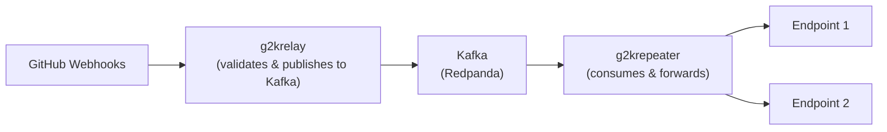

# g2k - GitHub to Kafka Webhook Processor

Consume GitHub webhook events to Kafka and forward them to one or multiple endpoints with flexible routing and filtering.



## g2krelay

A simple server to forward github webhook events to kafka keeping webhook headers and body intact.
All webhook events are validated with wbhook secret.

## g2krepeater

A kafka consumer that reads from the topic and sends POST requests to specified endpoint with the original webhook payload and headers.
This enables apps that use webhooks to be able to use kafka as a message bus without needing a change.

## Features

- **Persistent Storage**: Uses official Redpanda Helm chart with StatefulSet and PersistentVolumes (configurable)
- **High Availability**: Support for multiple replicas of both g2krelay and g2krepeater
- **Flexible Routing**: Deploy multiple g2krepeater instances with different configurations
- **Repository Filtering**: Route webhooks from specific repositories to specific endpoints
- **HMAC Validation**: All webhooks are validated using GitHub webhook secrets

## Running the server

For easy setup install `tilt` and `kind`

1. Create a `dev` `kind` cluster

```bash
kind create cluster --name dev
```

2. Run `tilt up`

The tilt setup uses `redpanda` for running kafka locally. In addition we bootstrap `redpanda-console` so that you can see the messages.

## Installation

### Using Helm

#### Quick Start with Default Configuration

The Helm chart includes everything needed to get started:

- Built-in Redpanda (Kafka) cluster with persistent storage
- g2krelay webhook receiver (port 5050)
- Full validation and message routing

**⚠️ Required Configuration**: You **must** provide a `WEBHOOK_SECRET` for GitHub webhook validation:

```bash
# Install with required webhook secret
helm install g2k oci://ghcr.io/vmelikyan/g2k --version 0.5.0 \
  --set g2krelay.envVars.WEBHOOK_SECRET="your-github-webhook-secret-here"
```

This creates a production-ready setup with:

- Persistent storage for message durability
- HMAC validation for webhook security
- Internal Kafka cluster (Redpanda) handling up to 10Gi of data

#### Install from OCI Registry (GitHub Container Registry)

```bash
# Basic installation (WEBHOOK_SECRET required)
helm install g2k oci://ghcr.io/vmelikyan/g2k --version 0.5.0 \
  --set g2krelay.envVars.WEBHOOK_SECRET="your-webhook-secret"

# Install with external Kafka (no Redpanda deployment)
helm install g2k oci://ghcr.io/vmelikyan/g2k --version 0.5.0 \
  --set global.kafka.enabled=false \
  --set global.kafka.externalBrokers="kafka.example.com:9092" \
  --set g2krelay.envVars.WEBHOOK_SECRET="your-webhook-secret"

```

#### Storage and External Kafka Options

**Built-in Redpanda (default)**:

- **StatefulSet** deployment with stable broker identities
- **Persistent volumes** that survive pod restarts (10Gi default)
- **Production-ready** configurations with automatic scaling
- **No external dependencies** - complete Kafka solution included

**External Kafka/Redpanda support**:

- Use existing Kafka clusters (AWS MSK, Confluent Cloud, self-hosted, etc.)
- Deploy only g2krelay and/or g2krepeater components
- Reduce resource usage in Kubernetes cluster
- Connect to external Redpanda clusters for better performance/cost

**External Kafka Configuration Examples**:

```bash
# Connect to external Redpanda cluster
helm install g2k oci://ghcr.io/vmelikyan/g2k --version 0.5.0 \
  --set global.kafka.enabled=false \
  --set global.kafka.externalBrokers="redpanda-cluster.example.com:9092" \
  --set g2krelay.envVars.WEBHOOK_SECRET="your-webhook-secret"


# Deploy only g2krelay (use external consumers)
helm install g2k oci://ghcr.io/vmelikyan/g2k --version 0.5.0 \
  --set global.kafka.enabled=false \
  --set global.kafka.externalBrokers="kafka.example.com:9092" \
  --set g2krelay.enabled=true \
  --set g2krelay.envVars.WEBHOOK_SECRET="your-webhook-secret" \
  --set g2krepeaters={}  # Disable all repeaters
```

#### Deploy Multiple Repeaters

The chart supports deploying multiple g2krepeater instances with different configurations (v0.4.0+):

```yaml
# values-custom.yaml
g2krelay:
  envVars:
    WEBHOOK_SECRET: "your-github-webhook-secret"

g2krepeaters:
  production:
    enabled: true
    replicas: 3
    envVars:
      KAFKA_GROUP_ID: "g2krepeater-production"
      REPLAY_ENDPOINTS: "https://prod.example.com/webhooks"
      REPO_FILTERS: "" # Process all repos

  development:
    enabled: true
    replicas: 1
    envVars:
      KAFKA_GROUP_ID: "g2krepeater-development"
      REPLAY_ENDPOINTS: "https://dev.example.com/webhooks"
      REPO_FILTERS: "myorg/frontend,myorg/backend"

  exclude-example:
    enabled: true
    replicas: 1
    envVars:
      KAFKA_GROUP_ID: "g2krepeater-exclude"
      REPLAY_ENDPOINTS: "https://webhook.example.com/api"
      REPO_EXCLUDE: "myorg/test-repo,myorg/archived-repo"
```

Then deploy:

```bash
helm install g2k oci://ghcr.io/vmelikyan/g2k --version 0.5.0 -f values-custom.yaml
```

### Tests

Run tests locally:

```bash
# Install helm-unittest plugin
helm plugin install https://github.com/helm-unittest/helm-unittest

# Run all tests
helm unittest helm/chart
```

### Using Docker Images

Individual components are available as Docker images:

```bash
# g2krelay
docker pull vmelikyan/g2krelay:latest

# g2krepeater
docker pull vmelikyan/g2krepeater:latest
```
