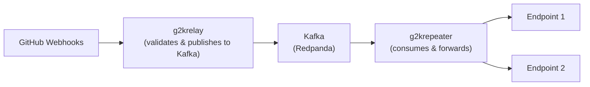

# g2k - GitHub to Kafka Webhook Processor

Consume GitHub webhook events to Kafka and forward them to one or multiple endpoints with flexible routing and filtering.



## g2krelay

A simple server to forward github webhook events to kafka keeping webhook headers and body intact.
All webhook events are validated with wbhook secret.

## g2krepeater

A kafka consumer that reads from the topic and sends POST requests to specified endpoint with the original webhook payload and headers.
This enables apps that use webhooks to be able to use kafka as a message bus without needing a change.

## Running the server

For easy setup install `tilt` and `kind`

1. Create a `dev` `kind` cluster

```bash
kind create cluster --name dev
```

2. Run `tilt up`

The tilt setup uses `redpanda` for running kafka locally. In addition we bootstrap `redpanda-console` so that you can see the messages.

## Installation

### Using Helm

#### Install from OCI Registry (GitHub Container Registry)

```bash
# Install directly from OCI registry
helm install g2k oci://ghcr.io/vmelikyan/g2k --version 0.4.0

# Install with custom values
helm install g2k oci://ghcr.io/vmelikyan/g2k --version 0.4.0 -f custom-values.yaml

# Install with specific image versions
helm install g2k oci://ghcr.io/vmelikyan/g2k --version 0.4.0 \
  --set g2krelay.image.tag=0.4.0 \
  --set g2krepeater.image.tag=0.4.0
```

#### Deploy Multiple Repeaters

The chart supports deploying multiple g2krepeater instances with different configurations (v0.4.0+):

```yaml
# values-custom.yaml
g2krepeaters:
  production:
    enabled: true
    replicas: 3
    envVars:
      KAFKA_GROUP_ID: "g2krepeater-production"
      REPLAY_ENDPOINTS: "https://prod.example.com/webhooks"
      REPO_FILTERS: ""  # Process all repos
  
  development:
    enabled: true
    replicas: 1
    envVars:
      KAFKA_GROUP_ID: "g2krepeater-development"
      REPLAY_ENDPOINTS: "https://dev.example.com/webhooks"
      REPO_FILTERS: "myorg/frontend,myorg/backend"
```

Then deploy:

```bash
helm install g2k oci://ghcr.io/vmelikyan/g2k --version 0.4.0 -f values-custom.yaml
```

### Using Docker Images

Individual components are available as Docker images:

```bash
# g2krelay
docker pull vmelikyan/g2krelay:latest

# g2krepeater
docker pull vmelikyan/g2krepeater:latest
```
